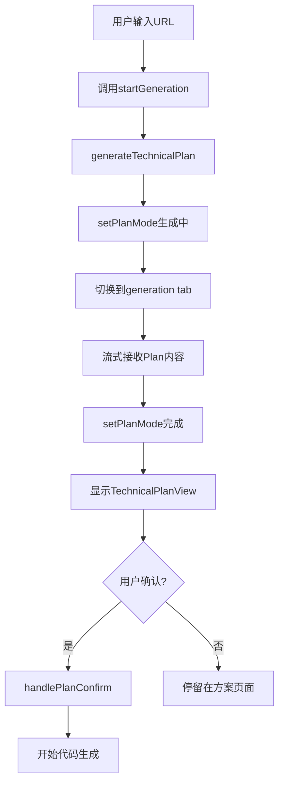

# 代码生成空白问题诊断与修复方案

## 问题描述

用户在使用Firecrawl克隆网站时，看到了以下消息：
1. "Starting to clone www.baidu.com/..."
2. "正在分析需求并制定技术方案，请稍候..."
3. "技术方案已生成，共计划生成 13 个文件"

但是当用户点击"Code"按钮时，代码区域显示为空白，没有看到生成的代码或技术方案。

## 根本原因分析

### 流程回顾



### 问题定位

从代码分析：

**app/generation/page.tsx:1297-1323**
```typescript
const renderMainContent = () => {
  // 🔥 优先显示技术方案视图（Plan 模式）
  if (planMode === 'generating' || planMode === 'complete') {
    return (
      <TechnicalPlanView
        planContent={planContent}
        isGenerating={planMode === 'generating'}
        summary={planSummary || undefined}
        suggestedManifest={suggestedManifest}
        onConfirm={handlePlanConfirm}  // 确认按钮回调
        onEdit={() => { ... }}
        onCancel={() => { ... }}
      />
    );
  }

  // 只有在代码生成后才显示代码视图
  if (activeTab === 'generation' &&
      (generationProgress.isGenerating || generationProgress.files.length > 0)) {
    return (/* 代码文件列表 */);
  }

  // 否则显示预览iframe
  return (/* Preview iframe */);
}
```

**关键发现**：
1. 当`planMode === 'complete'`时，**必然显示**`TechnicalPlanView`组件
2. `TechnicalPlanView`组件包含"✓ 确认方案，开始生成代码"按钮（components/TechnicalPlanView.tsx:108-113）
3. 用户**必须点击确认按钮**才会触发`handlePlanConfirm()`开始代码生成
4. 如果用户没有点击确认，代码不会生成，`generationProgress.files`数组为空
5. 切换到Code tab时，由于`generationProgress.files.length === 0`，没有内容显示

## 问题原因

### 可能性1：TechnicalPlanView组件未正确渲染

**症状**：用户看到chat消息但没有看到方案内容

**原因**：
- `planContent`为空字符串
- 或者SSE流式响应中断，没有接收到`plan_chunk`数据
- 或者CSS样式问题导致组件不可见

### 可能性2：用户错过了确认按钮

**症状**：用户直接点击"Code"按钮期望看到代码

**原因**：
- 用户没有注意到`TechnicalPlanView`组件中的确认按钮
- UI不够明显，用户没有意识到需要确认
- 用户习惯性地点击Code tab切换

### 可能性3：Tab切换逻辑问题

**症状**：切换到Code tab后看到空白

**原因**：
- `renderMainContent()`第一个if判断会覆盖tab切换
- 但如果`planMode`被意外重置为`'idle'`，会进入第二个if判断
- 由于没有代码生成，`generationProgress.files.length === 0`，返回空白

## 修复方案

### 方案A：改进UI提示（推荐）

#### 1. 禁用Code Tab直到代码生成

```typescript
// app/generation/page.tsx
<button
  onClick={() => setActiveTab('generation')}
  disabled={planMode === 'complete' || (generationProgress.files.length === 0 && !generationProgress.isGenerating)}
  className={`px-3 py-1 rounded transition-all text-xs font-medium ${
    activeTab === 'generation'
      ? 'bg-white text-gray-900 shadow-sm'
      : planMode === 'complete'
      ? 'bg-transparent text-gray-400 cursor-not-allowed'  // 禁用状态
      : 'bg-transparent text-gray-600 hover:text-gray-900'
  }`}
  title={planMode === 'complete' ? '请先确认技术方案' : ''}
>
  <div className="flex items-center gap-1.5">
    <svg width="14" height="14" fill="none" viewBox="0 0 24 24" stroke="currentColor">
      <path strokeLinecap="round" strokeLinejoin="round" strokeWidth={2} d="M10 20l4-16m4 4l4 4-4 4M6 16l-4-4 4-4" />
    </svg>
    <span>Code</span>
  </div>
</button>
```

#### 2. 添加明显的确认引导

```typescript
// components/TechnicalPlanView.tsx
{!isGenerating && onConfirm && (
  <>
    {/* 添加醒目的提示条 */}
    <div className="bg-blue-50 border-l-4 border-blue-500 p-4 mb-4">
      <div className="flex items-center">
        <div className="flex-shrink-0">
          <svg className="h-5 w-5 text-blue-500" viewBox="0 0 20 20" fill="currentColor">
            <path fillRule="evenodd" d="M18 10a8 8 0 11-16 0 8 8 0 0116 0zm-7-4a1 1 0 11-2 0 1 1 0 012 0zM9 9a1 1 0 000 2v3a1 1 0 001 1h1a1 1 0 100-2v-3a1 1 0 00-1-1H9z" clipRule="evenodd" />
          </svg>
        </div>
        <div className="ml-3 flex-1">
          <p className="text-sm text-blue-700 font-medium">
            技术方案已生成完毕，请确认后开始代码生成
          </p>
        </div>
        <button
          onClick={() => onConfirm(suggestedManifest || [])}
          className="ml-3 px-4 py-2 text-sm font-medium text-white bg-blue-600 rounded-lg hover:bg-blue-700 transition-colors shadow-sm animate-pulse"
        >
          ✓ 确认并开始生成代码
        </button>
      </div>
    </div>

    {/* 原有按钮组 */}
    <div className="flex gap-2">
      {/* ... */}
    </div>
  </>
)}
```

#### 3. 添加Code Tab空白时的提示

```typescript
// app/generation/page.tsx
if (activeTab === 'generation' && generationProgress.files.length === 0 && !generationProgress.isGenerating) {
  return (
    <div className="flex items-center justify-center h-full bg-gray-50">
      <div className="text-center max-w-md px-6">
        <svg className="w-16 h-16 mx-auto mb-4 text-gray-300" fill="none" viewBox="0 0 24 24" stroke="currentColor">
          <path strokeLinecap="round" strokeLinejoin="round" strokeWidth={1.5} d="M10 20l4-16m4 4l4 4-4 4M6 16l-4-4 4-4" />
        </svg>
        <h3 className="text-lg font-medium text-gray-900 mb-2">代码尚未生成</h3>
        <p className="text-sm text-gray-600 mb-4">
          {planMode === 'complete'
            ? '技术方案已就绪，请确认方案后开始生成代码'
            : '请先分析需求并生成技术方案'}
        </p>
        {planMode === 'complete' && (
          <button
            onClick={() => {/* 切换回方案视图或直接触发确认 */}}
            className="px-4 py-2 bg-blue-600 text-white rounded-lg hover:bg-blue-700"
          >
            返回查看技术方案
          </button>
        )}
      </div>
    </div>
  );
}
```

### 方案B：自动确认方案（不推荐）

这个方案会跳过用户确认环节，直接开始代码生成。但这违反了让用户Review技术方案的设计初衷。

```typescript
// app/generation/page.tsx:2897-2905
if (data.type === 'plan_complete' && data.plan) {
  console.log('[generateTechnicalPlan] 方案生成完成');
  setPlanMode('complete');
  setPlanSummary(data.plan.summary);
  setSuggestedManifest(data.plan.suggestedManifest);
  addChatMessage(`技术方案已生成，共计划生成 ${data.plan.suggestedManifest.length} 个文件`, 'system');

  // 🔥 自动确认方案（可选，需权衡用户体验）
  // setTimeout(() => handlePlanConfirm(), 2000); // 2秒后自动开始
}
```

## Playwright E2E测试脚本

创建 `tests/code-generation-blank.spec.ts`：

```typescript
import { test, expect } from '@playwright/test';

test.describe('代码生成空白问题测试', () => {
  test('完整流程：从URL输入到代码生成', async ({ page }) => {
    // 1. 访问generation页面
    await page.goto('http://localhost:3001/generation');

    // 2. 输入URL
    await page.fill('input[placeholder*="URL"]', 'https://www.baidu.com');

    // 3. 点击生成按钮
    await page.click('button:has-text("Generate")');

    // 4. 等待Plan模式消息
    await expect(page.locator('text=正在分析需求并制定技术方案')).toBeVisible({ timeout: 10000 });

    // 5. 等待Plan生成完成
    await expect(page.locator('text=技术方案已生成')).toBeVisible({ timeout: 60000 });

    // 6. 验证TechnicalPlanView组件显示
    await expect(page.locator('text=技术实现方案')).toBeVisible();
    await expect(page.locator('button:has-text("确认方案")')).toBeVisible();

    // 7. 验证Code Tab被禁用或有提示
    const codeTab = page.locator('button:has-text("Code")');
    const isDisabled = await codeTab.isDisabled();
    console.log('Code Tab disabled:', isDisabled);

    // 8. 点击确认方案
    await page.click('button:has-text("确认方案，开始生成代码")');

    // 9. 等待代码生成开始
    await expect(page.locator('text=Live generation')).toBeVisible({ timeout: 10000 });

    // 10. 等待代码生成完成
    await expect(page.locator('text=files generated')).toBeVisible({ timeout: 120000 });

    // 11. 验证Code Tab可用且有内容
    await page.click('button:has-text("Code")');
    await expect(page.locator('.file-explorer')).toBeVisible();

    // 12. 截图
    await page.screenshot({ path: 'test-results/code-generation-success.png', fullPage: true });
  });

  test('点击Code Tab时的空白状态提示', async ({ page }) => {
    // 1. 访问generation页面
    await page.goto('http://localhost:3001/generation');

    // 2. 直接点击Code Tab（没有代码生成）
    await page.click('button:has-text("Code")');

    // 3. 验证空白状态提示
    await expect(page.locator('text=代码尚未生成')).toBeVisible();

    // 4. 截图
    await page.screenshot({ path: 'test-results/code-tab-empty-state.png' });
  });
});
```

## 实施步骤

### Step 1: 修复UI（优先级P0）

1. ✅ 实现Code Tab禁用逻辑
2. ✅ 添加TechnicalPlanView明显的确认按钮提示
3. ✅ 添加Code Tab空白状态的友好提示

### Step 2: E2E测试（优先级P0）

1. ✅ 运行Playwright测试验证完整流程
2. ✅ 验证UI改进是否有效
3. ✅ 记录测试结果和截图

### Step 3: 文档更新（优先级P1）

1. ✅ 更新用户指南，说明确认方案的步骤
2. ✅ 添加troubleshooting文档

## 验收标准

- [ ] 用户能够清楚地看到技术方案内容
- [ ] 确认按钮足够醒目，用户不会错过
- [ ] Code Tab在代码未生成时显示友好提示
- [ ] 完整流程E2E测试通过
- [ ] 没有UI闪烁或状态不一致问题

## 预期效果

修复后的用户体验：

1. 用户输入URL后，自动切换到generation tab
2. 看到"正在分析需求并制定技术方案..."消息
3. Plan内容以打字机效果显示
4. Plan完成后，看到**醒目的蓝色提示条**和**确认按钮**
5. Code Tab被**禁用**或显示tooltip提示"请先确认技术方案"
6. 用户点击确认后，代码开始生成
7. 代码生成时，Code Tab自动启用
8. 切换到Code Tab时，看到文件列表和代码内容
